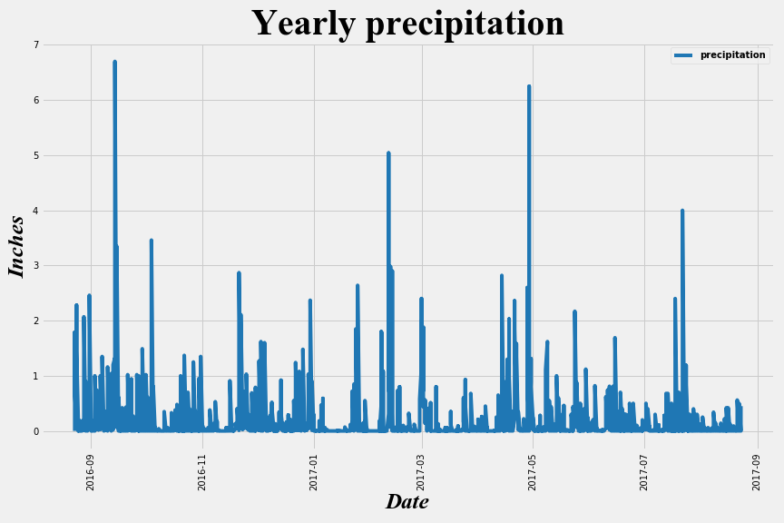
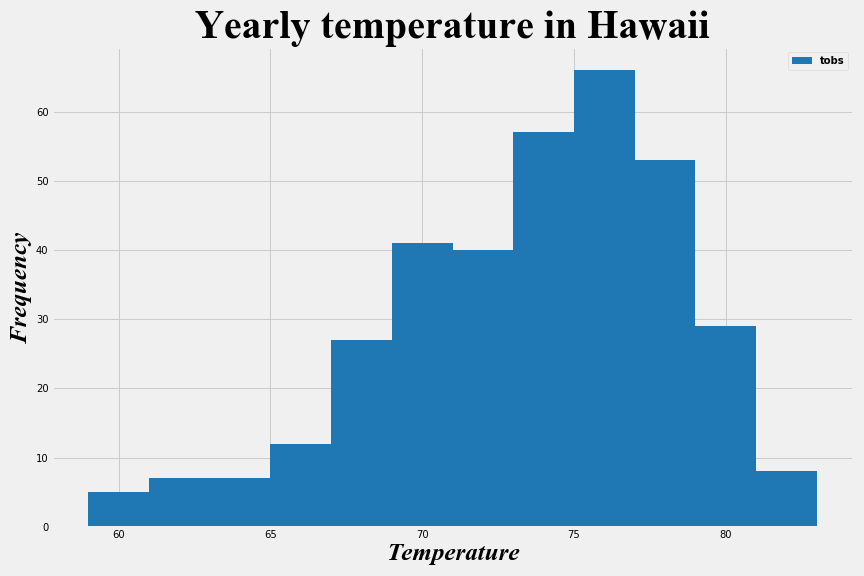
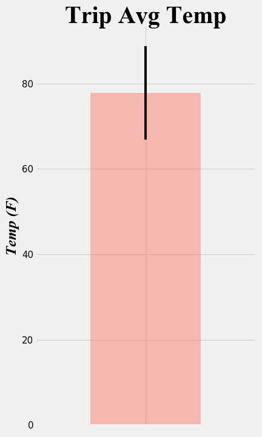
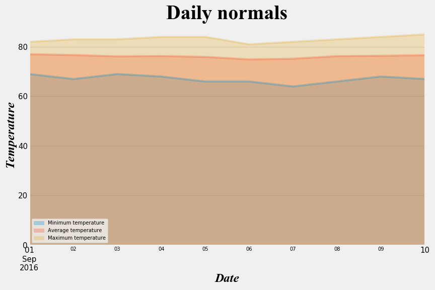

# Data Science trip analysis
## Background

You've decided to treat yourself to a long holiday vacation in Honolulu, Hawaii! To help with your trip planning, you need to do some climate analysis on the area.

## Objective

Climate analysis for planning a trip to Hawaii using SQLAlchemy.

